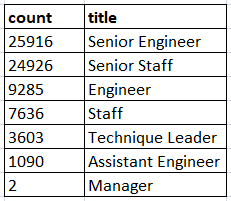
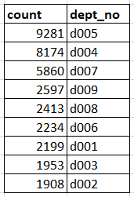
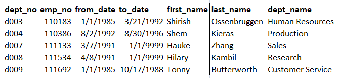

# Pewlett Hackard Analysis

## Overview of the Analysis

This analysis seeks to develop and organize data on the employees that are close to retirement at Pewlett Hackard in order to ease the transition process as new employees are found to fill their positions. The results presented here reveal which positions in the company will see the heaviest losses as people begin to retire and which employees are eligible to participate in the employee mentorship program.

## Results

### Retirement by Title

* Based on the results of our query, it appears that the two positions that will lose the most employees to the retirement wave are the Senior Engineer and Senior Staff positions. There are currently 25,916 Senior Engineers and 24,926 Senior Staff members who will soon be eligible for retirement, as displayed in the chart below.
* The remaining positions (Engineer, Staff, Technique Leader, and Assistant Engineer) will not be impacted as greatly as the Senior Engineer and and Senior Staff positions, but will still have between 1,000 and 10,000 employees eligible for retirement. 
* The company will lose 2 out of a total of 5 managers as a result of the upcoming retirement wave.

### Mentorship Eligibility
* Pewlett Hackard has 1,550 employees eligible for the mentorship program.
* There are no managers in this list of 1,550 eligible employees. It will be important to address this gap and develop a strategy for how to train the two managers that will succeed the ones expected to retire.

## Summary

In summary, the results of this analysis reveal that the two positions that will see the largest turnover during the retirement wave are the positions of Senior Engineer and Senior Staff. We can also see that the two departments that will see the largest turnover are Development and Production, according to the results of the query displayed below.

Although there will be a large number of employees preparing to retire soon, there is also a large pool of employees eligible to participate in the mentorship program. This reassuring news as it means a smooth transition is possible through staggered hiring and mentorship. 

However, two of the five managers at Pewlett Hackard (listed in the query below) are likely to retire in the near future and are not currently eligible for the mentorship program. A strategy will need to be developed for how to train the two managers that will the succeed those managers about to retire.

